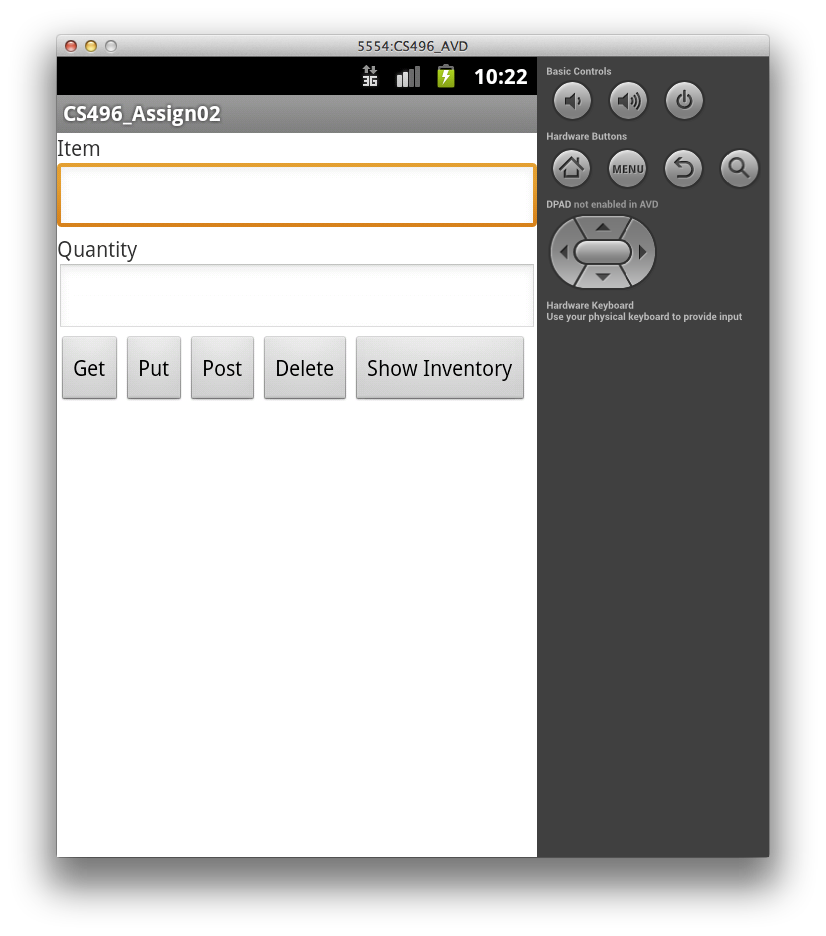
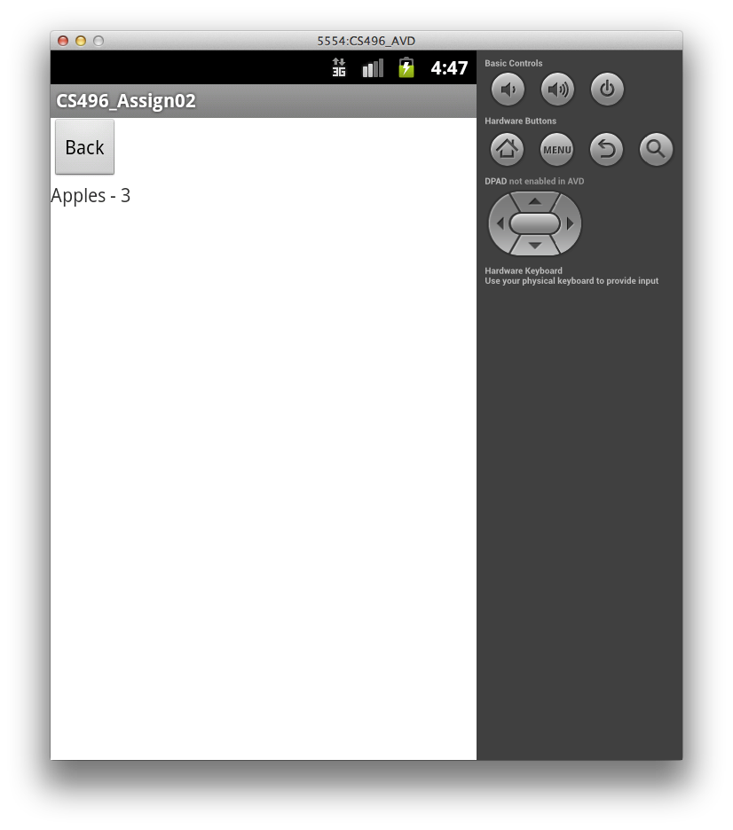
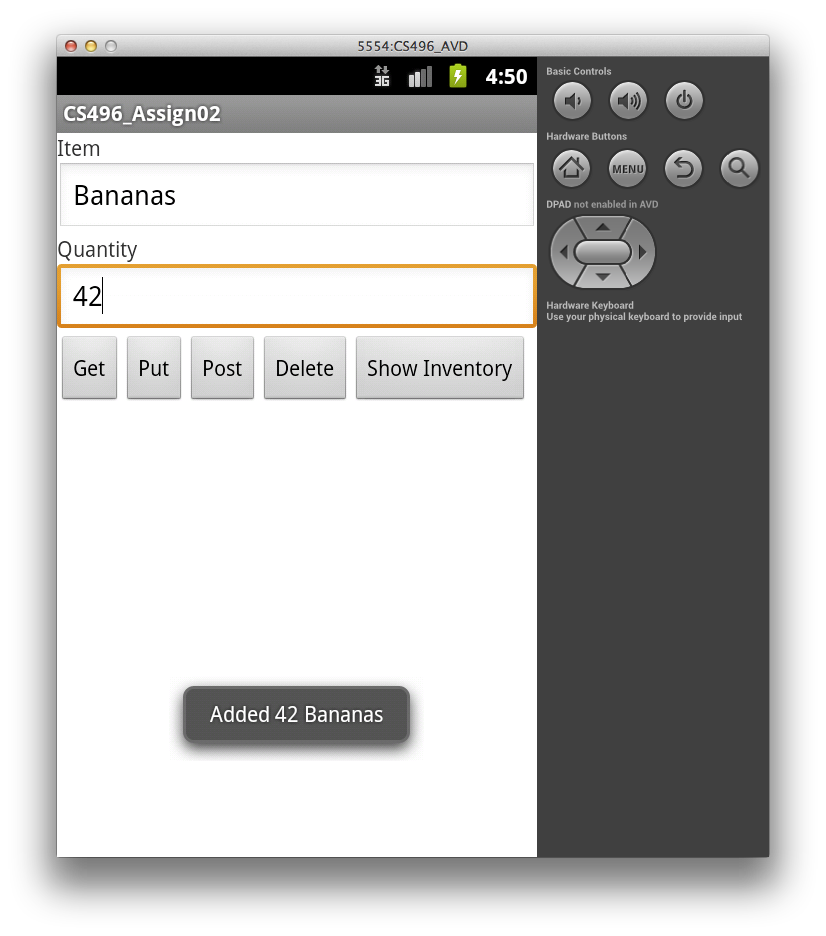
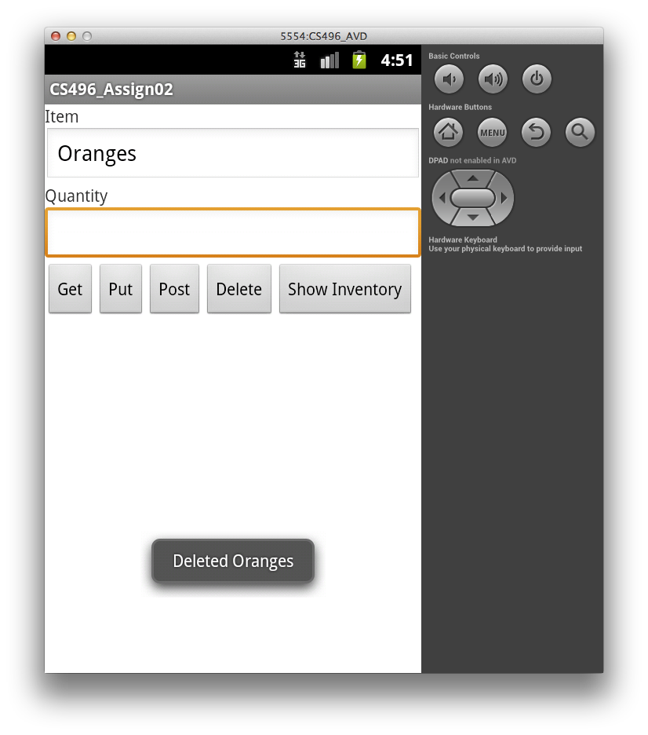
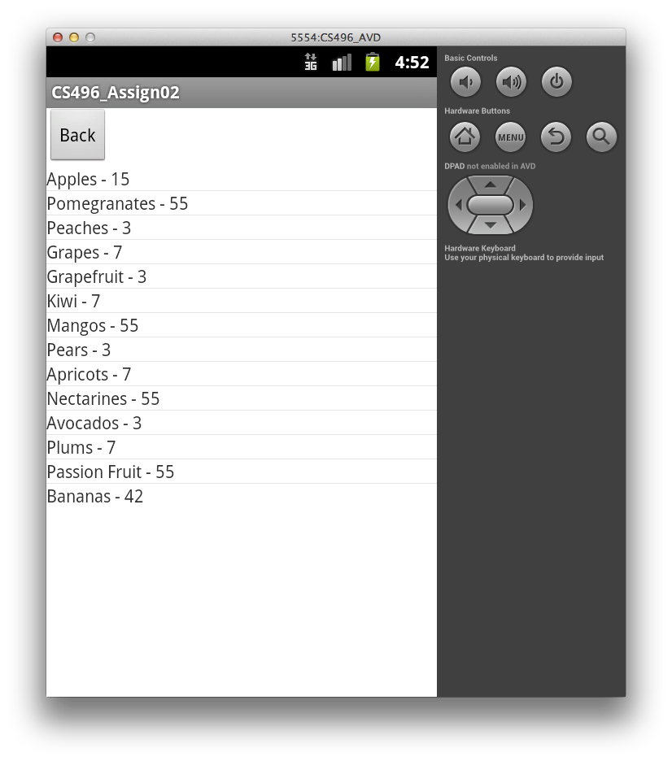

**Due:** Friday, Feb 28th by 11:59 PM

This is an **individual** assignment

Getting Started
===============

Download [CS496\_Assign02.zip](CS496_Assign02.zip) and [CS496\_Assign02\_WebService.zip](CS496_Assign02_WebService.zip) and import them into the Eclipse workspace you use for Android development.  (Use the ADT version of Eclipse.)  Also download and import [CS496\_Jetty.zip](CS496_Jetty.zip) if it is not already in your workspace.

This assignment consists of creating a mobile client to access the inventory web service created in [Assignment 1](assign01.html). Hence the same **Item** model object will be used in order to maintain JSON compatibility.

Your Tasks
==========

Your tasks involve:

-    Creating a mobile UI that allows the user to enter relevant information to either retrieve, modify, or delete items from the inventory.
-    Add corresponding mobile controllers to send RESTful API operation requests to the server.
-    Process any appropriate responses from the server to be display results in the mobile app.

Implementing the Mobile Client
------------------------------

An example mobile client UI might create:

-   two **EditText** components allowing the user to enter an item name and quantity
-   four **Button** components allowing the user to send either a **GET**, **PUT**, **POST**, or **DELETE** request using the information from the **EditText** boxes
-   one **Button** component to show the entire current inventory stored on the server

You may choose to enhance the UI if you wish.

> 

The requirements for the mobile client are that it should retrieve the information from the **EditText** boxes (i.e. the item name and quantity) and produce the appropriate request based on the button clicked as follows:

-   **Get** - if no item name is entered in the **EditText** box, the app should display the entire inventory (**not** as JSON) using the same *dynamic* layout as **Show Inventory** described below. If an item name is entered in the **EditText** box, the app should display *just that item* (if it exists in the inventory) along with its current quantity using the same *dynamic* layout as **Show Inventory** described below but with only a single item. Both cases should create an appropriate **GET** URI to retrieve the requested information. Note: **GET** requests *do not* have a JSON payload.

> 

-   **Put** - should require that an item name and quantity are in the **EditText** boxes, create a valid JSON object for this item (see the Hints below), and send a **PUT** request with the JSON object as the *payload* which should *update* the specified item. Since multiple items cannot be entered with the mobile app, the app should not be able to replace the entire inventory. Instead, **PUT** should create an appropriate **PUT** URI that appends both the item's name to the path as well as includes the JSON object in the body. 

> 

-   **Post** - should require that an item name and quantity are in the **EditText** boxes, create a valid JSON object for the item, and send a **POST** request with the JSON as the *payload* to *add* the new item.

> 

-   **Delete** - if no item name is entered in the **EditText** box, the app should delete the *entire* inventory. If an item name is entered in the **EditText** box, just that item should be deleted (if it exists in the inventory). Both cases should create an appropriate **DELETE** URI to remove the specified item. Note: **DELETE** requests *do not* have a JSON payload but may append the item's name to the path.

> 

-   **Show Inventory** - should display the entire current inventory retrieved from the server in a new *dynamic* layout that contains a **Back** button to return the user to the original data entry view and a **ListView** for the items (which automatically will provide scroll capabilities for large inventories).

> 

Since **PUT**, **POST**, and **DELETE** do not inherently generate output, display a **Toast** message informing the user as to what action has been performed (and if it was successfully completed)

Hints
-----

In order to test your mobile client, you can run the provided web service implementation by running the **Main** class in the **CS496\_Assign02\_WebService** project as a Java application.

For the URI's, you can access the web service running on **localhost** through the Android emulator via the IP address 10.0.2.2 and port 8081.

Use separate controller objects for each of the REST requests (similar to server side) that are called from the corresponding button click callbacks. In each class, have a method which instantiates an appropriate **HttpGet**, **HttpPut**, **HttpPost**, or **HttpDelete** object.

Create two methods for setting the layout - one that loads the initial layout from **activity_main.xml** and the other which creates a dynamic **LinearLayout** view. Call each of these methods as needed from button click methods. Have the *dynamic* layout method take an **Item[]** parameter (allowing it to be reused for displaying either the entire inventory retrieved from the server or a partial inventory consisting of just a single item).

A JSON object can be created to add to the payload of a request as follows:

	// Create JSON object from Item
	Item newItem = new Item();
	newItem.setName(itemName);
	newItem.setQuantity(quantity);
	StringWriter sw = new StringWriter();
	JSON.getObjectMapper().writeValue(sw, newItem);

	// Add JSON object to request
	StringEntity reqEntity = new StringEntity(sw.toString());
	reqEntity.setContentType("application/json");
	request.setEntity(reqEntity);

To populate a **ListView** from an array of strings (named **listArray**) and add it to a *dynamic* layout

	ListAdapter la = new ArrayAdapter<String>(this, R.layout.list_item, listArray);
	ListView lv = new ListView(this);
	lv.setAdapter(la);		
	layout.addView(lv);

Grading
=======

Your grade will be assigned as follows:

-   Original input layout: 10%
-   Dynamic output layout: 10%
-   Get - 30%
-   Put - 20%
-   Post - 20%
-   Delete - 10%

**Extra Credit:** When the entire inventory is displayed, allow the user to select a row from the list which then returns to the data entry view with the item's name and quantity in the **EditText** boxes.

Submitting
==========

Select the **CS496\_Assign02** project, then click the blue up arrow icon, and enter your Marmoset username and password when prompted.

Alternatively, export the **CS496\_Assign02** project to a zipfile, and upload the zipfile to Marmoset as **assign02**:

> [https://cs.ycp.edu/marmoset](https://cs.ycp.edu/marmoset)

<b>Important</b>: please do <b>not</b> submit the <b>CS496_Jetty</b> or <b>CS496_Assign02_WebService</b> projects as part of your submission.  Only submit <b>CS496_Assign02</b>.

<!-- vim:set wrap: ­-->
<!-- vim:set linebreak: -->
<!-- vim:set nolist: -->
