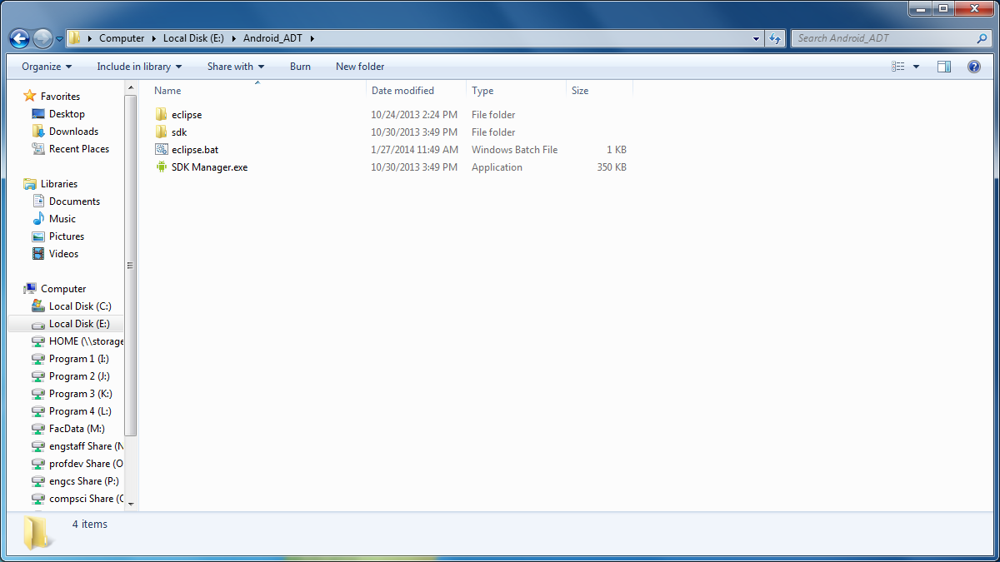
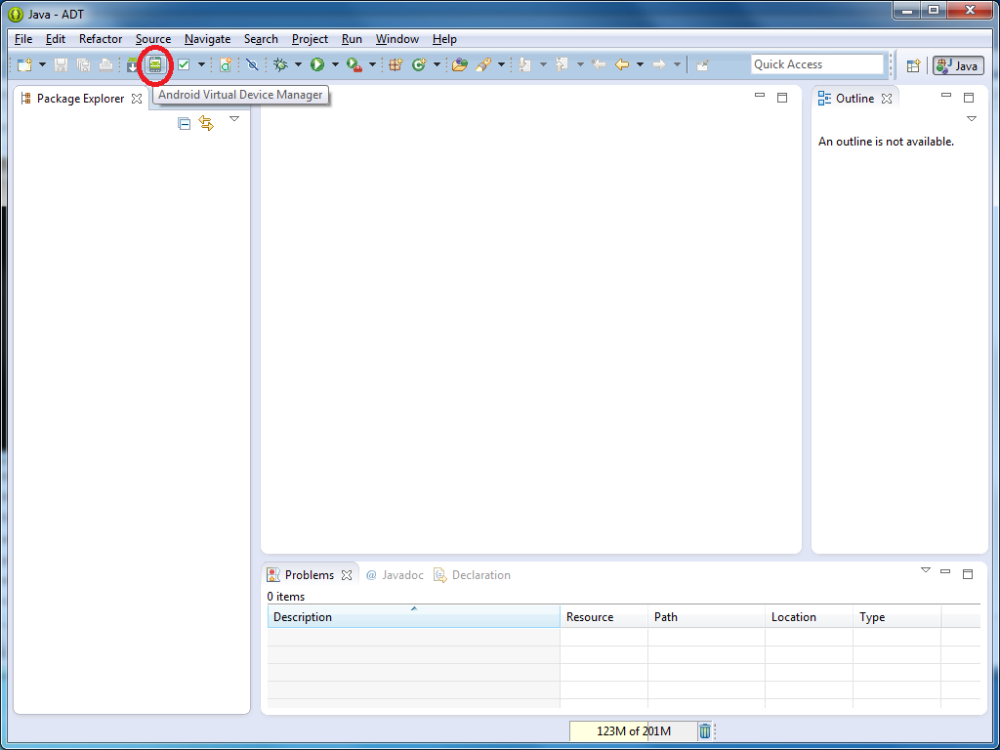
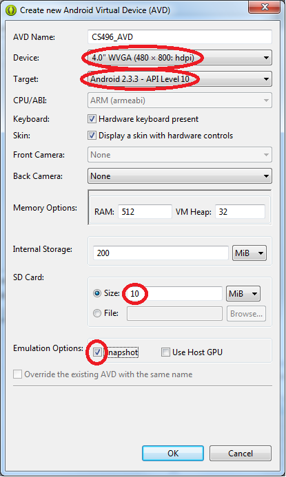
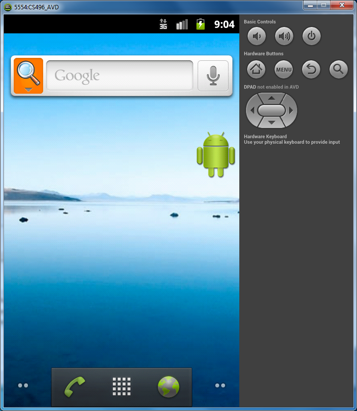
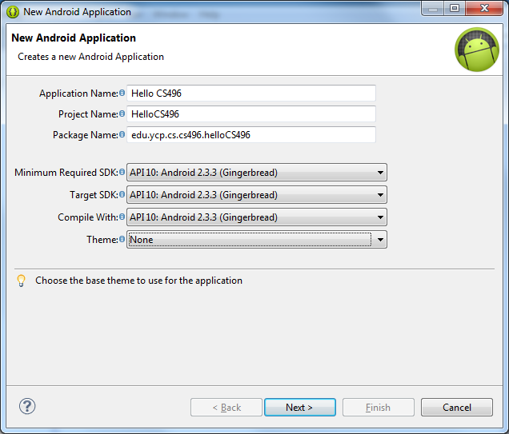
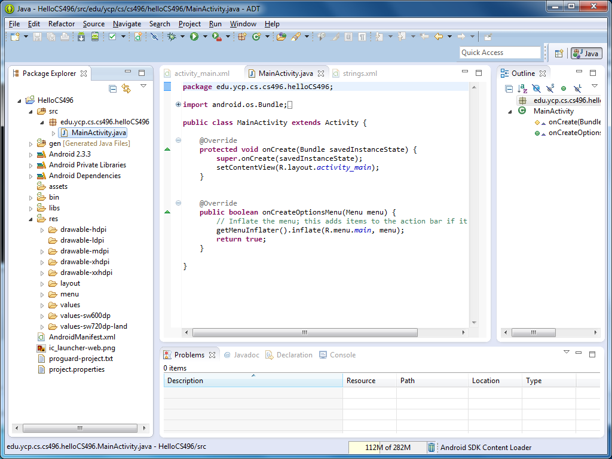
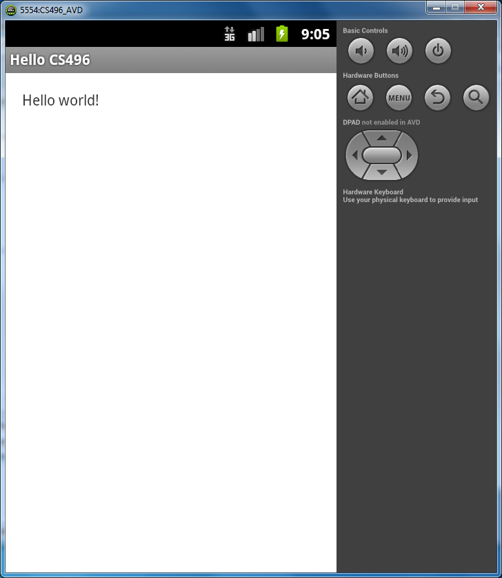
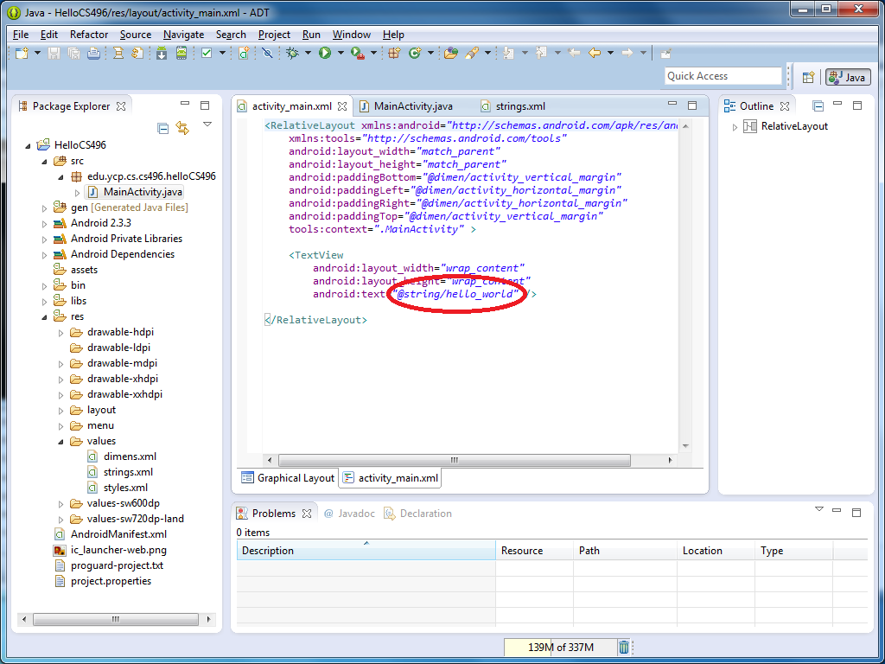
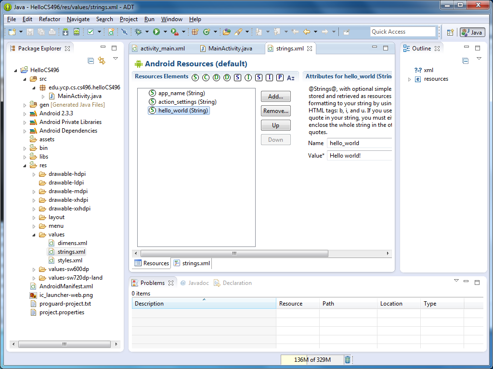
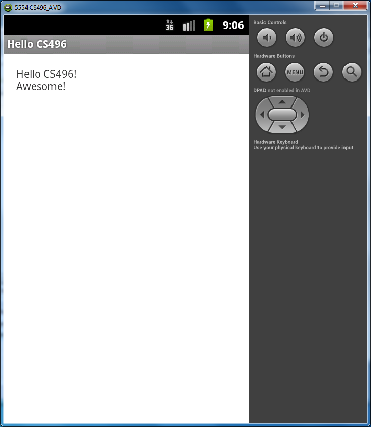

Background
==========

Android ADT bundle (ADT)
------------------------

Since Android applications are written in Java, any standard Java IDE can be used for development. However, Google provides plug-ins for Eclipse as well as a preconfigured Eclipse IDE environment package [Android Developer Tools (ADT)](http://developer.android.com/sdk/index.html). There is also an early release development environment called [Android Studio](http://developer.android.com/sdk/installing/studio.html) based on the IntelliJ IDEA development environment. For this class, we will be using the Eclipse ADT bundle.

Android Virtual Devices (AVD)
-----------------------------

In order to test our Android applications (since we do not have actual Android devices) we will need to create an *Android Virtual Device* (AVD). This emulator will then be invoked and the corresponding *.apk* file downloaded to the emulator when we run our application. 

Activity
========

Obtain ADT
----------

Obtain a flash drive from the instructor that contains the eclipse ADT bundle, the Android 2.3.3 (Gingerbread) SDK, and the tools needed for Android development (e.g. AVD Manager).

> 

In the **Android_ADT** directory there will be a batch file named **eclipse.bat** (which configures the SDK path to use the flash drive). Double click this file to launch Eclipse. Set your workspace to somewhere on your network drive, e.g. **H:\My Documents\CS496\Android**. 

Create AVD
----------

To create an AVD, we will use the AVD Manager through Eclipse (the given example values are the ones we will use in this class):

-   Select the Android Virtual Device Manager in the Eclipse toolbar

> 

-   Select a *New* AVD from the top button on the right side
-   Configure an AVD using the following settings:
	-   Give the AVD any name you wish, e.g. **CS496_AVD**
	-   From the *Device* dropdown box, select the desired device/screen resolution, e.g. **4.0" WVGA (480 x 800: hdpi)**
	-   From the *Target* dropdown box, select the desired API level the emulator should use, e.g. **Android 2.3.3 - API Level 10**
	-   In the *SD Card* box, make a small sized virtual SD Card, e.g. **10** MiB
	-   Check the **Snapshot** checkbox such that the current state of the emulator will be saved when the emulator is closed - **THIS WILL MAKE THE EMULATOR MUCH FASTER WHEN STARTING UP!**
	-   Select *OK*

> 

Select the newly created AVD and click the **Start** button and leave the default values on the pop-up screen to launch the AVD (which will take some time for the initial boot as it builds the snapshot). Subsequent launches will be much faster. Eventually you should see the following emulator window.

> 

You can create as many AVD's as you wish to test your application on a range of different API's and device resolutions.

Hello World!
------------

To create a basic Android application simply choose **File -> New -> Android Application Project**. Set the following configuration values

-   Give the application the name **Hello CS496** (which will automatically set the project name)
-   Change the Package name to **edu.ycp.cs.cs496.helloCS496** 
-   Set all the SDK dropdowns to **API 10: Android 2.3.3 (Gingerbread)**
-   Change the **Theme** to **None** (since they are not supported in versions below API 11)
-   Click **Next >** to accept the defaults on all subsequent windows

> 

This should create a simple Android application. You will notice that Android applications use a similar directory structure as other Java applications. Some folders to note are:

-   *src* - where component source files are located
-   *assets* - where any files used by the application can be placed, e.g. database files
-   *res* - resource file directories

    > -   *drawable-*\* for various image files (e.g. program and button icons). The different *\*dpi* subdirectories allow for different icons to be used depending on the resolution of the device the application is being run on.
    > -   *layout* - contains the XML layout files for each Activity used in the application, e.g. **activity_main.xml** for a single Activity application
    > -   *values* - contains XML files for any static values the application uses, e.g. **strings.xml** for static string constants.

The other directories contain auto-generated files for the application. Additionally, the **AndroidManifest.xml** file contains a list of all components the application will use along with permissions for services, etc.

> 

At this point you should be able to run this application (select the green arrow in the Eclipse toolbar and choose **Android Application** in the **Run As** dialog) which will start the simulator (from the last snapshot), load the application onto the simulator, and launch the application.

> 

Hello CS496!
------------

Select the **activity_main.xml** tab in Eclipse and the **activity_main.xml** tab at the bottom of the editor window which will show you the XML for the layout of the main app window. The text that is displayed in the app is stored in the **hello_world** resource element of the **string** asset. This is a good practice for any static text as it allows for localization of your applications.

> 

To change the value of this field

-   Expand the **res** folder
-   Expand the **values** subfolder
-   Select the **strings.xml** file
-   Select the **hello_world** element
-   Change the **value** field from "Hello World!" to "Hello CS496!\nAwesome!"

> 

Now if you run the application you should see the following:

> 

Congratulations! You've just written your first Android app (without a single line of code). Next we will learn how to use the Android framework to communicate with a web service and enhance the UI of the app.
