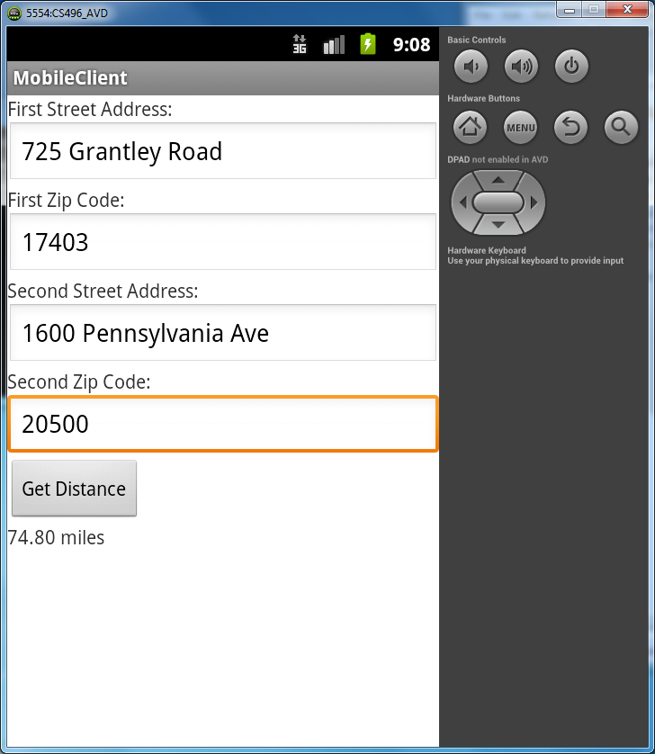

The lab activity is described in the Activity\_ section below.

Background
==========

Android UI Widgets
------------------

Most views in an Android application contain various UI widgets that allow user interaction with the program. The types of widgets and their layout can be described either through XML files (good for static layouts) or created dynamically at run time programatically (good for dynamic layouts). We will explore designing UI layouts later in the course. For this lab, the view layout is contained in the *res/layout/activity_main.xml* file which will be loaded by the activity's **.onCreate()** method. An example file for a basic application that simply displays a single line of text is:

    <?xml version="1.0" encoding="utf-8"?>
    <LinearLayout xmlns:android="http://schemas.android.com/apk/res/android"
        android:layout_width="fill_parent"
        android:layout_height="fill_parent"
        android:orientation="vertical" >

        <TextView
            android:id="@+id/helloLabel"
            android:layout_width="fill_parent"
            android:layout_height="wrap_content"
            android:text="@string/hello" />

    </LinearLayout>

Note that the *TextView* (which is basically a label) can be referred to in the application by its *id* (**helloLabel** in this example). The *id* allows us to access and/or modify a UI component. Thus, for example, we could programatically change the text for the label in the above Activity by

    TextView label = (TextView) findViewById(R.id.helloLabel);
    label.SetText("How are you?");

Here the method **.findViewById()** accesses the resources of the application through the *R* object (which contains all of the resources included in the app). Note the correspondance between the requested *id* and the one specified in the XML file.

HTTP requests in Android
------------------------

Since Android applications are written in Java, we can utilize many of the same classes as we did on the PC when accessing web services. Thus we can issue requests and receive responses (possibly in JSON or XML) and process them in a similar fashion. In particular, we can use the same [Apache HttpComponents](http://hc.apache.org/). discussed in [Lab 5a](lab05a.html) (For complete details, [read the tutorial](http://hc.apache.org/httpcomponents-client-ga/tutorial/html/).) Hence an example web request to the geocoding service from [Lab 5a](lab05a.html) might be

    // Create HTTP client
    HttpClient client = new DefaultHttpClient();

    // Create list of request paramater/value pairs
    List<NameValuePair> params = new ArrayList<NameValuePair>();
    params.add(new BasicNameValuePair("postalcode", "17403");
    params.add(new BasicNameValuePair("placeName", "725 Grantley Rd");
    params.add(new BasicNameValuePair("country", "US"));
    params.add(new BasicNameValuePair("username", "ycpcs_cs496"));

    // Create URI
    URI uri;
    uri = URIUtils.createURI("http", "api.geonames.org", -1, "/postalCodeSearchJSON", 
                URLEncodedUtils.format(params, "UTF-8"), null);

    // Create HTTP request from uri
    HttpGet request = new HttpGet(uri);

    // Execute request and get response
    HttpResponse response;
    response = client.execute(request);

    // Obtain the response body
    HttpEntity entity = response.getEntity();

At this point, the web service has provided a JSON or XML response that we need to extract from the response payload and parse accordingly (after verifying the status code of the response). Since Android is Java based, we can use the same **ObjectMapper** class from the [Jackson](https://github.com/FasterXML/jackson) libraries to create Java objects from the JSON response.

Parsing JSON
------------

To convert the **HttpEntity** object to JSON, we will extract the contents of the response body, use the **JSON.getObjectMapper()** method as before, and call the **readValue()** method (using **getContents()** on the entity extracted from the response) to convert the JSON-encoded response body to Java objects:

    MyClass myObj = JSON.getObjectMapper().readValue(resp.getContents(), MyClass.class);
    
Note: If the JSON contains a list of objects, as long as our **POJO** contains a corresponding **List<>** field the **ObjectMapper** will take care of creating the list and assigning the appropriate values to the **List** items.

Activity
========

Your task is to duplicate the functionality from [Lab 5a](lab05a.html) in an Android application.

Starting point code: [CS496\_Lab05b.zip](CS496_Lab05b.zip). You should add code to **MainActivity.java**.

As a reminder of the geocoding API:

> <http://www.geonames.org/export/free-geocoding.html>

Internet Access
---------------

**IMPORTANT**

Since this application will require access to the Internet, we must tell Android to **allow permission** for Internet access. This is done in the **AndroidManifest.xml** file (be sure to select the **AndroidManifest.xml** tab at the bottom of the editor window to view the XML text). Thus we need to add the following line just before the **<application** tag

    <uses-permission android:name="android.permission.INTERNET" />

Hence the XML should look like

    ...
    <uses-sdk
    	android:minSdkVersion="10"
    	android:targetSdkVersion="10" />
    
    <uses-permission android:name="android.permission.INTERNET" />
    <application
    	android:allowBackup="true"
    ...

Model and Controller classes
----------------------------

Since the underlying object and controller classes are identical to the terminal web client from [Lab 4](lab04.html), we simply need to link the model and controller class packages via the build path. 

Note how separating the model and controller classes from the UI allows for them to be easily shared between projects

Data input from widgets
-----------------------

Instead of obtaining the street addresses and zip codes from the terminal (via a keyboard scanner), in the **CallWebService()** method the information should be retreived from the [EditText](http://developer.android.com/reference/android/widget/EditText.html) widgets specified in the Activity's UI (refer to **res/layout/activity_main.xml** for the corresponding **id**'s of the widgets). For example, to get an object corresponding to the text box for the first street address

    EditText firstStreet = (EditText) findViewById(R.id.firstStreet);

Then the **getText()** method can be called on the **EditText** object to retrieve the text currently in the text box (as an [Editable](http://developer.android.com/reference/android/text/Editable.html) object which can be converted to a string via the **toString()** method).

Creating HTTP request
---------------------

The HTTP request can be created in a similar fashion to [Lab 5a](lab05a.html) by creating a **List** of **NameValuePair** objects corresponding to the necessary parameters and values needed for the request. 

You will need to have key/value pairs for the following parameters:

-   **postalcode** - the zip code
-   **placeName** - the street address
-   **country** - should be set to "US"
-   **username** - should be set to **ycpcs_cs496**

Once the parameter list is created, you can define a **URI** object and use it to construct an **HttpGet** request which is executed through the **HttpClient** object's **execute()** method. The return value should be stored in an **HttpResponse** object.

Parsing the returned JSON data
------------------------------

The HTTP JSON response can be parsed using an **ObjectMapper** using the **PostalCodes** model class (which simply contains a **List** of **PostalCode** objects that represent the data for each location).

You can find the (approximate) distance in miles between two **PostalCode** objects (which contains *lat* and *lng* fields) through a **ComputeDistance** controller object which takes two **PostalCode** objects and returns a **Result** object (which simply contains a **double value** field).

The value stored in the **Result** object can then be displayed in the **distanceLabel** widget using the **.setText()** method. Thus a sample run in the AVD is

> 

<!-- vim:set wrap: ­-->
<!-- vim:set linebreak: -->
<!-- vim:set nolist: -->
