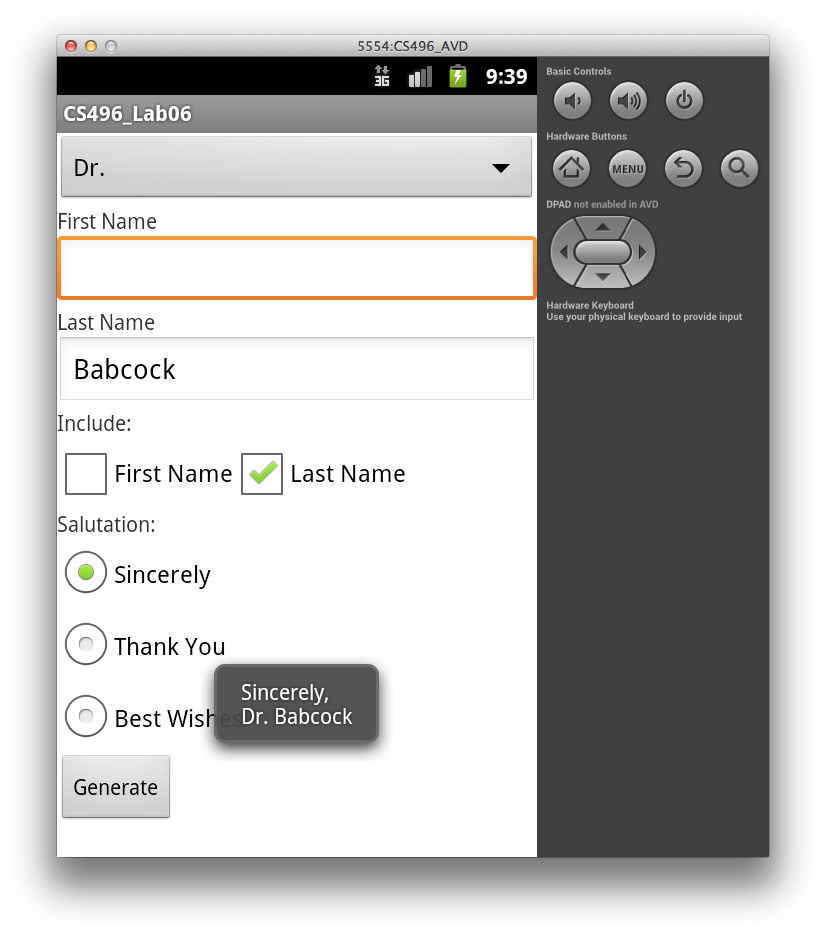
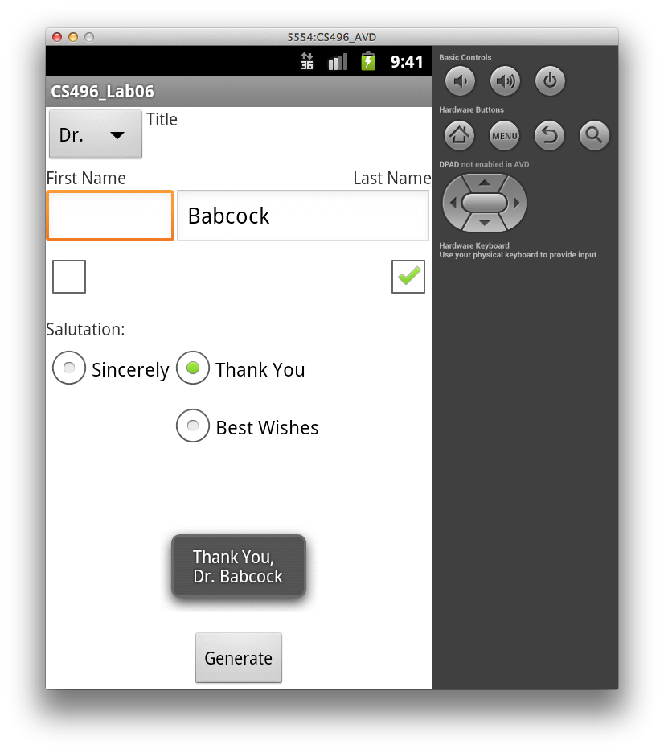

Getting Started
===============

Import [CS496\_Lab06.zip](CS496_Lab06.zip) into Eclipse (**Import-\>General-\>Existing Projects into Workspace-\>Archive File**).

You should see source code for an activity named **Salutation**.

Your Tasks
==========

Absolute View Layout
--------------------

Create a layout for the view in **activity\_main.xml** (inside the **res/layout** directory) to create a layout similar to

> 

-    Make sure to give each widget a unique **id** attribute. 
-    For the CheckBoxes, use the XML attribute fields to give the *first name* checkbox a click handler named **onFirstNameClicked** and for the *last name* checkbox a click handler named **onLastNameClicked**. (Note: for this lab these callbacks will not be used but callback stubs are provided in the activity class.) 
-    For the RadioButtons, give all of them the same *onClick* callback attribute.
-    *Do not* give the button an *onClick* callback attribute. 

*Hint:* For the CheckBoxes, consider placing them inside a nested **LinearLayout** with **horizontal** orientation to have them displayed side by side. Be sure to consider what the appropriate extent settings are for each widget.

Spinner Resource
----------------

In **strings.xml** (in the **res/values** directory), add the following resources:

-   a **string** named **titlePrompt** with the value **Title**
-   a **string-array** named **titles** with items **(none)**, **Mr.**, **Mrs.**, **Miss**, and **Dr.**.

Activity Code
-------------

Add code in **Salutation.java** for the following:

-   In the Salutation class, add two private **String** variables named **title** and **salutationMsg**.
-   In **onCreate()** add code to populate the **Spinner** widget by creating an **ArrayAdapter** from the string array resource defined in the previous section. Attach a **TitleSelectedListener** object to the spinner (which will be defined later).
-   In the **Salutation** class, add a click handler for the radio buttons with the same name used in the layout resource. In the callback, set the **salutationMsg** field to the text from the selected RadioButton.
-   In the **Salutation** class, create a nested class named **TitleSelectedListener** that implements **OnItemSelectedListener**. This class should implement two **public void** functions named **onItemSelected()** and **onNothingSelected()** with appropriate parameters as shown in [lecture06](../lecture/lecture06.html).

    > -   In the **onItemSelected()** method, if the first item (**(none)**) is *not* selected retrieve the item from **parent** at location **pos** (use the **getItemAtPosition()** method), convert it to a string, and store it in **title**. (Otherwise set it to the empty string)
    > -   In the **onNothingSelected()** method, simply set **title** to the empty string.

-   In **onCreate()** add code to add a click callback to the button widget. In the overridden **onClick()** method:

    > -   Get objects for both CheckBoxes and EditText boxes.
    > -   Show an error if neither CheckBox is selected (indicating no name was chosen)
    > -   Show an error if a CheckBox is selected but the corresponding EditText is empty.
    > -   Otherwise retrieve the names from the EditBoxes *only* for the ones that are selected and create a message string made up of the **salutationMsg** on the first line, and the **title** with selected names on the second line. Display the complete salutation in a Toast message.

Hint: Recall that to display a Toast message:

    Toast.makeText(Salutation.this, msg, Toast.LENGTH_SHORT).show();

Relative View Layout
--------------------

Once you have the absolute layout app working, modify the UI to use some relative layouts to produce the view as shown below:

> 

You should not need to change any of the activity code.

Hints:

-   Consider positioning the widgets that are relative to the *parent* window first (i.e. ones that are at the edges of the window)
-   For the EditText boxes, place them in a (nested) horizontal LinearLayout with appropriate weights
-   Align the CheckBoxes with respect to the corresponding EditText boxes (rather than the parent window)
-   Use a (nested) TableLayout *inside* the RadioGroup to position the RadioButtons (note the first column of the second row is blank)
