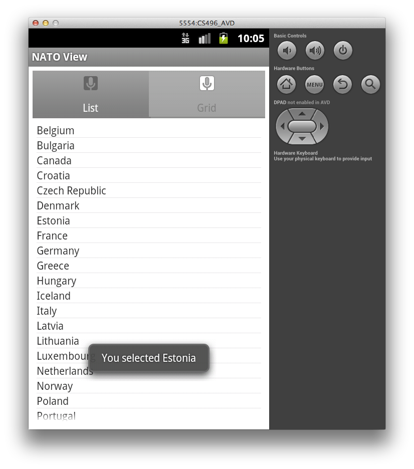
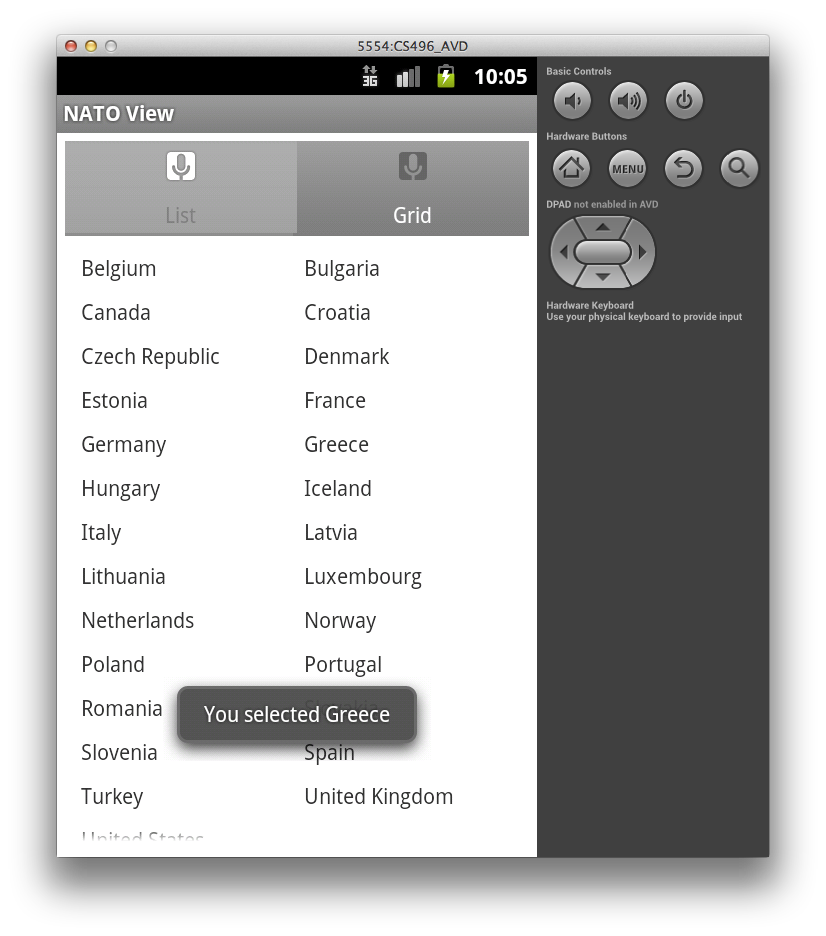
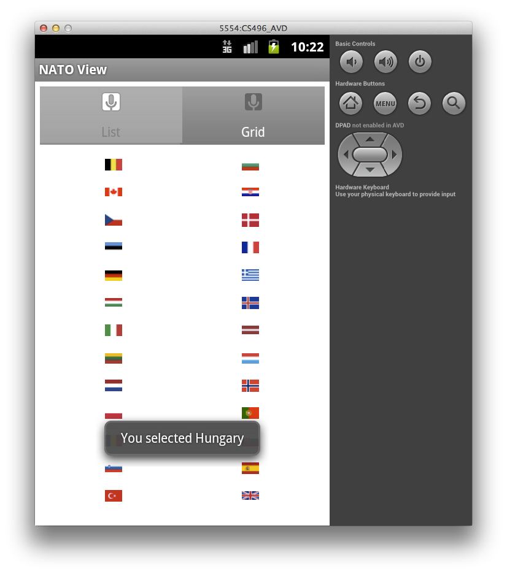
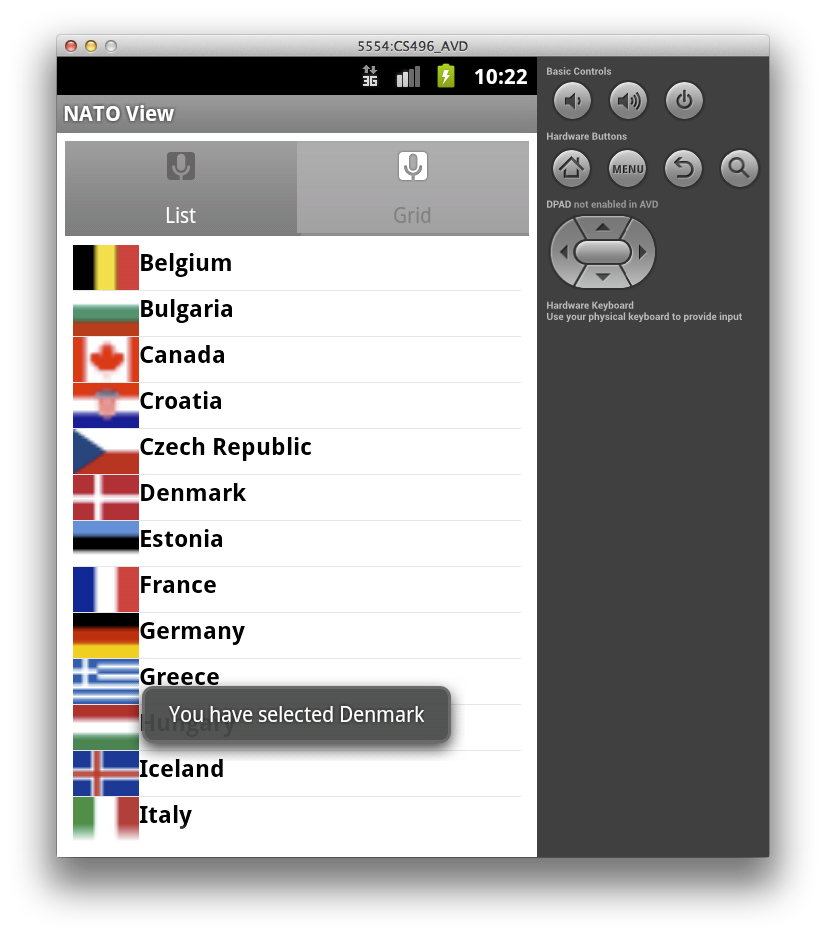

Getting Started
===============

Import [CS496\_Lab07.zip](CS496_Lab07.zip) into Eclipse (**Import-\>General-\>Existing Projects into Workspace-\>Archive File**).

You should see source code for activities named **MainTabView**, **ListTabActivity**, and **GridTabActivity**.

Note that since we have multiple activities in the project, they have been declared in the **AndroidManifest.xml** file.

Your Tasks
==========

In this lab we will create two different tab views for the NATO countries (stored as a **string-array** in **values/strings.xml**).

**Set up tab view**

First set up the tabs

-   In **activity\_main.xml** set up a vertical **LinearLayout** for the tabs using **TabHost**, **TabWidget**, and **FrameLayout** tags. NOTE: Be sure to give the widgets the following **id**'s:
	- **TabHost** an **id** of **@android:id/tabhost**
	- **TabWidget** an **id** of **@android:id/tabs**
	- **FrameLayout** an **id** of **@android:id/tabcontent**.
-   In the **MainTabView** activity class, change the base class to **TabActivity**. Then add code to **onCreate()** to set up two tabs: 
	- The first is the **ListTabActivity**
	- The second is the **GridTabActivity**
-   Set the initial tab to the **ListTabActivity** tab. Simply use **ic\_tab1** icons for both tabs (later you may wish to experiment with changing the icons for each tab).

At this point you should have a basic tabbed view (with a simple TextView placeholder in each tab) which looks similar to

> 

**Set up list tab**

To set up the list tab

-   Create a file named **list\_item.xml** in the **res/layout** directory and place a basic **TextView** in the file.
-   In the **ListTabActivity** activity class, change the base class to **ListActivity** and remove the **setContentView()** call as we will be building the layout programmatically.
-   Add code to **onCreate()** to build a **ListAdapter** from the **string-array** named **countries** provided in the **strings.xml** resource file, set the list adapter to this one, and then register an item click callback for the list view that displays a simple **Toast** message for the item selected.

Now the list tab should appear as

> 

**Set up grid tab**

To set up the grid tab

-   In **grid\_layout.xml** replace the **TextView** with a **GridView** (use the attributes from the example in [lecture07](../lectures/lecture07.html)).
-   In the **GridTabActivity** activity class, add code to **onCreate()** to build an **ArrayAdapter<String\>** adapter from the same **string-array** as the list tab, set the grid view adapter to this one, and register an item click callback for the grid view that displays a simple **Toast** message for the item selected.

The grid tab should appear as

> 

Advanced Views
==============

We can enhance the appearance of our list/grid views by incorporating images into the items within the views. However to do this requires creating our own adapter subclasses from the [BaseAdapter](http://developer.android.com/reference/android/widget/BaseAdapter.html) base class. We then need to override the **getView()** method which returns the view for each item to allow us to customize the returned views with whatever content we wish.

Extend grid tab to display flag images
--------------------------------------

In the **res/drawable** directory are thumbnail images for all the flags of the NATO countries (from [wikipedia](http://en.wikipedia.org/wiki/Member_states_of_NATO)). We can create a custom **ImageAdapter** class (from the [Android tutorials](http://developer.android.com/resources/tutorials/views/hello-gridview.html) that loads these images for the grid view.

**Create custom ImageAdapter class**

Create a new class named **ImageAdapter** which extends the **BaseAdapter** class. Add the following private fields to the class (for references to the images).

    // reference to the activity context
    private Context mContext;

    // references to our images
    private Integer[] mThumbIds = {
            R.drawable.belgium, R.drawable.bulgaria,
            R.drawable.canada, R.drawable.croatia,
            R.drawable.czechrepublic, R.drawable.denmark,
            R.drawable.estonia, R.drawable.france,
            R.drawable.germany, R.drawable.greece,
            R.drawable.hungary, R.drawable.iceland,
            R.drawable.italy, R.drawable.latvia,
            R.drawable.lithuania, R.drawable.luxembourg,
            R.drawable.netherlands, R.drawable.norway,
            R.drawable.poland, R.drawable.portugal,
            R.drawable.romania, R.drawable.slovakia,
            R.drawable.slovenia, R.drawable.spain,
            R.drawable.turkey, R.drawable.unitedkingdom,
            R.drawable.unitedstates           
    };  

Next add the following methods to the class

    public ImageAdapter(Context c) {
        mContext = c;
    }

    public int getCount() {
        return mThumbIds.length;
    }

    public Object getItem(int position) {
        return null;
    }

    public long getItemId(int position) {
        return position;
    }

    // create a new ImageView for each item referenced by the Adapter
    public View getView(int position, View convertView, ViewGroup parent) {
        ImageView imageView;
        if (convertView == null) {  // if it's not recycled, initialize some attributes
            imageView = new ImageView(mContext);
            imageView.setLayoutParams(new GridView.LayoutParams(44, 30));
            imageView.setScaleType(ImageView.ScaleType.CENTER_CROP);
            imageView.setPadding(8, 8, 8, 8);
        } else {
            imageView = (ImageView) convertView;
        }

        imageView.setImageResource(mThumbIds[position]);
        return imageView;
    }

The important method is **getView()** which takes as a parameter the **position** of the particular cell which we can use to access the corresponding image from the resources. We then use the image resource to create an **ImageView** which is displayed in the grid cell.

Finally in the **GridTabActivity** class, rather than using the **string-array** adapter, simply use an instance of the ImageAdapter by

    gv.setAdapter(new ImageAdapter(this));

Now the grid tab should look like

> 

Furthermore in the item click callback, you could use the **pos** parameter (returned by the **getItemId()** method in the **ImageAdapter** class) to access an element of the string array (retrieved from the string resources) containing the names of the countries to produce a **Toast** message with the selected country's name.

Extend the list tab to display images and text
----------------------------------------------

Often it is useful to be able to customize the rows in a list view, e.g. to contain images and text. Again to accomplish this we will use a customized adapter class that populates the fields of a view defined by an XML file (based on [this example](http://blog.sptechnolab.com/2011/02/01/android/android-custom-listview-items-and-adapters/)).

**Create the view for rows in the list**

Create a file named **list.xml** in the **res/layout** directory which will contain the layout for the rows. Since we want to have an image and country name text field, our layout might be:

    <?xml version="1.0" encoding="utf-8"?>
    <LinearLayout xmlns:android="http://schemas.android.com/apk/res/android"
        android:orientation="horizontal"
        android:layout_width="fill_parent"
        android:layout_height="wrap_content">
        <ImageView
        android:id="@+id/img"
        android:scaleType="centerCrop"
        android:layout_width="44dp"
        android:layout_height="30dp"/>

        <TextView
        android:layout_width="fill_parent"
        android:id="@+id/title"
        android:layout_height="wrap_content"
        android:textStyle="bold"
        android:textColor="#ffffff"
        android:textSize="16sp" />

    </LinearLayout>

**Add local fields**

Now in the **ListTabActivity** class we will add the following fields

    private LayoutInflater mInflater;
    private Vector<RowData> data;
    RowData rd;

    // references to our images
    private Integer[] imgid = {
            R.drawable.belgium, R.drawable.bulgaria,
            R.drawable.canada, R.drawable.croatia,
            R.drawable.czechrepublic, R.drawable.denmark,
            R.drawable.estonia, R.drawable.france,
            R.drawable.germany, R.drawable.greece,
            R.drawable.hungary, R.drawable.iceland,
            R.drawable.italy, R.drawable.latvia,
            R.drawable.lithuania, R.drawable.luxembourg,
            R.drawable.netherlands, R.drawable.norway,
            R.drawable.poland, R.drawable.portugal,
            R.drawable.romania, R.drawable.slovakia,
            R.drawable.slovenia, R.drawable.spain,
            R.drawable.turkey, R.drawable.unitedkingdom,
            R.drawable.unitedstates           
    };

    // references to our images
    static final String[] title = {
            "Belgium", "Bulgaria",
            "Canada", "Croatia",
            "Czech Republic", "Denmark",
            "Estonia", "France",
            "Germany", "Greece",
            "Hungary", "Iceland",
            "Italy", "Latvia",
            "Lithuania", "Luxembourg",
            "Netherlands", "Norway",
            "Poland", "Portugal",
            "Romania", "Slovakia",
            "Slovenia", "Spain",
            "Turkey", "United Kingdom",
            "United States"           
    };

which creates a local **LayoutInflater** object which will be used to parse out the XML layout file, a *Vector* of *RowData* objects for the entire list which will be used to initialize the custom adapter, a **RowData** object (to be defined later) which will create each individual row, and two local arrays containing the image references with corresponding text strings.

**Add local helper classes**

**RowData**

Next add a local private class named **RowData** as

    private class RowData {
        protected int mId;
        protected String mTitle;

        // Constructor
        RowData(int id,String title){
            mId=id;
            mTitle = title;
        }

        @Override
        public String toString() {
            return mId+" "+mTitle;
        }
    }

which simply has a constructor and a **toString()** method which returns a string representation for the row data.

**CustomAdapter**

Now add a local private class for the custom adapter named **CustomAdapter** that extends **ArrayAdapter<RowData\>** as

    private class CustomAdapter extends ArrayAdapter<RowData> {

        // Constructor
        public CustomAdapter(Context context, int resource,
            int textViewResourceId, List<RowData> objects) {               

            super(context, resource, textViewResourceId, objects);
        }

        @Override
        public View getView(int position, View convertView, ViewGroup parent) {   

            ViewHolder holder = null;
            TextView title = null;
            ImageView i11=null;

            // Create row from selected item
            RowData rowData= getItem(position);

            // Parse row layout file
            if(null == convertView){
                convertView = mInflater.inflate(R.layout.list, null);
                holder = new ViewHolder(convertView);
                convertView.setTag(holder);
            }           
            holder = (ViewHolder) convertView.getTag();

            // Set TextView title
            title = holder.gettitle();
            title.setText(rowData.mTitle);

            // Set ImageView to image
            i11=holder.getImage();
            i11.setImageResource(imgid[rowData.mId]);
            return convertView;
        }
    }

where the **getView()** method parses up the row XML layout using the **LayoutInflater** object and assigns the appropriate data to the different tags in the view using a **ViewHolder** object defined below.

**ViewHolder**

Create one more local private class named **ViewHolder** as

    private class ViewHolder {
        private View mRow;
        private TextView title = null;
        private ImageView i11=null; 

        public ViewHolder(View row) {
            mRow = row;
        }
        public TextView gettitle() {
            if(null == title){
                title = (TextView) mRow.findViewById(R.id.title);
            }
            return title;
        }     

        public ImageView getImage() {
            if(null == i11){
                i11 = (ImageView) mRow.findViewById(R.id.img);
            }
            return i11;
        }
    }

which basically just contains getter methods for the various layout objects stored in a row.

**Instantiate the adapter for the list**

Finally, in the **onCreate()** method for the activity we can instantiate a **CustomAdapter** and use it to populate the list as

    public void onCreate(Bundle savedInstanceState) {
        super.onCreate(savedInstanceState);
        setContentView(R.layout.imagelist_layout);

        mInflater = (LayoutInflater) getSystemService(Activity.LAYOUT_INFLATER_SERVICE);
        data = new Vector<RowData>();
        for(int i=0;i<title.length;i++){

            try {
                rd = new RowData(i,title[i]);
            } catch (ParseException e) {
                    e.printStackTrace();
            }
            data.add(rd);
        }
        CustomAdapter adapter = new CustomAdapter(this, R.layout.list,
                                                 R.id.title, data);
        setListAdapter(adapter);
        getListView().setTextFilterEnabled(true);
    }

where we obtain the **LayoutInflater** object for the activity, generate new rows for each of the items in the local arrays, create the adapter using the vector of row data, and finally use the adapter for the list.

An item click callback can also be added to perform some behavior based on a selected item from the list.

The list view should look similar to

> 

This basic framework can be extended to add more widgets into the layout (via the **list.xml** XML file) with appropriate additional getters and field assignments to populate the new widgets.
