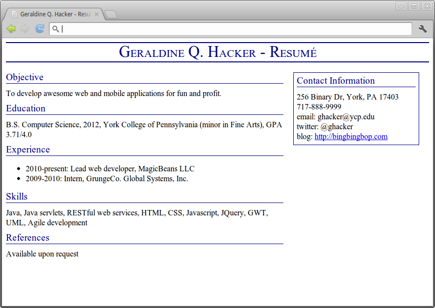

Your Task
=========

Use HTML and CSS to create a resume that looks like the following (click for full-size):

> 

The text in the page title should be rendered in small caps.

The page title and the text of section headers should be dark blue.

The resume should have a title running across the top (with dark blue bars above and below).

The content area should be to the left and the sidebar (contact info) should be to the right.

Use **div** and **span** elements with id and class attributes to specify the body of the HTML document. All visual styling should be done separately in CSS rules.

Hints
-----

Try floating the content and sidebar divs to the left.

Use **width** properties to set the widths of the content and sidebar divs. For example, I have

    width: 540px;

on my content div, and

    width: 240px;

on my sidebar div.

You can use an unordered list for experience section: something like

    <ul>
        <li>Item 1</li>
        <li>Item 2</li>
    </ul>

Use the **border** property to draw a solid border around the sidebar.

Use the **border-top** and **border-bottom** properties to draw the horizontal lines above and below the title.

You can use the tag

     

to end a line of text.

You will need to use margins to spread things out a bit. (For example, you should have some vertical space between resume sections.)
