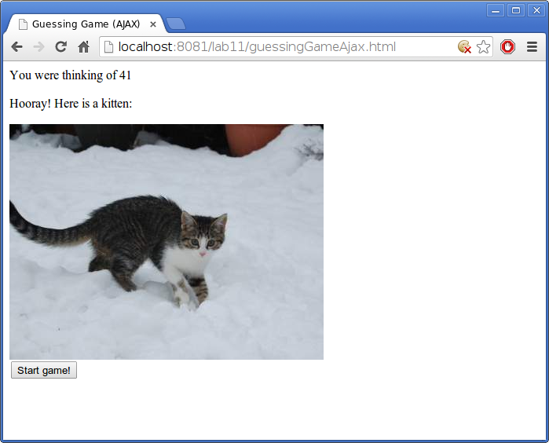

# Getting started

Download [CS496\_Lab11.zip](CS496_Lab11.zip) and import it into Eclipse. You should see a project named **CS496\_Lab11**.  Note that this project depends on the **CS496\_Jetty** project which you should already have in your workspace.

You can start the web application by running **Main.java** (in the **main** source folder) as a Java application.

Once the webapp is running, open the URL [http://localhost:8081/lab11](http://localhost:8081/lab11) in a web browser.

# Your task

The project implements basic versions of *add numbers* and *guessing game* applications, using AJAX to communicate with the server without a page reload.  All computation is done on the server.

Modify these applications as follows.

**Add numbers**: Change the *add numbers* application so that it can perform other operations (such as subtraction, multiplication, and division).  You may want to create a new HTML/Javascript file for the client UI and a new servlet to handle requests.

**Guessing game**: Change the *guessing game* application to make the UI look nicer.  You could try adding **class** attributes to the elements created in the UI and using CSS rules to style them (using fonts, colors, etc.)  Also, try displaying an image when the program guesses the correct value.  For example:

[placekitten.com](http://placekitten.com) is an excellent resource for pictures of kittens.

<!-- vim:set wrap: ­-->
<!-- vim:set linebreak: -->
<!-- vim:set nolist: -->
