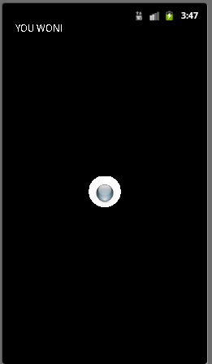

Getting Started
===============

Import [CS496\_Lab12.zip](CS496_Lab12.zip) into Eclipse (**Import-\>General-\>Existing Projects into Workspace-\>Archive File**).

You should see source code for **MarbleMadness**, **Panel**, **ViewThread**, and **Sprite**.

Your Tasks
==========

In this lab we will create a basic [Marble Madness](http://en.wikipedia.org/wiki/Marble_Madness) type game (except that the goal will only be to get the ball to stop in the center "hole" on the screen).

Set up sprite class
-------------------

In **Sprite.java**:

-   Add code to the constructor to set each of the class fields based on the parameters.

-   Add code to the **update()** method to increment the position based on the current velocity and elapsed time (divide the **elapsedTime** parameter by 20 for a more useable game). Also add a call to the **checkBoundary()** function after the position has been updated to perform collision detection if the sprite reaches the extents of the window.

-   Add code to the **doDraw()** method to simply render the sprite bitmap using the **Canvas** parameter (with the **drawBitmap()** method).

-   Add code to the **checkBoundary()** method to reverse the velocity whenever the sprite reaches the edge of the window (stored in the **Panel.mWidth** and **Panel.mHeight** public fields).

Set up thread class
-------------------

In **ViewThread.java**:

-   Add fields for a **Panel** object, a **SurfaceHolder** object, and two **long** variables for the start and current elapsed time. In the constructor, set the **Panel** field using the parameter and obtain the panel's **SurfaceHolder** object (using the **getHolder()** method of the panel).

-   Add code to the **run()** method to lock the canvas object, compute the current elapsed time, update the panel object, draw the panel object, and release the lock on the canvas object. Do not forget to update the start time variable with the new current time.

Set up the panel class
----------------------

In **Panel.java**:

-   Add fields for
	-   **Sprite** (for the ball object), a field for a thread object, a field for a **Paint** object
	-   **boolean** flag for the current game state. 
	
-   Add code in the constructor to
	-   Register the class as the callback (using **getHolder.addCallback(this);**)
	-   Create new thread and paint objects
	-   Set the color for the paint object to white (using the method **setColor(Color.WHITE)** of the paint object)
	-   Set the game flag to **false**.
	-   Add one sprite to the list (for the ball) starting at (0,0) (or wherever you wish) and with a random velocity between -3 and 3. Don't forget to set the field for the number of sprites.

-   Add code to **surfaceCreated()** to create and start the rendering thread.

-   Add code to **surfaceDestroyed()** to stop the rendering thread.

-   Add code to **update()** to call the update method on the ball sprite. Be sure to do this in a *thread safe* manner. Also call the **checkGameEnd()** method (assigning the return value to the game flag).

-   Add code to **doDraw()** to draw a circle in the center of the screen for the "hole" with radius **holeRadius**. Then call the draw method on the ball sprite. Be sure to do this in a *thread safe* manner. Also add a check of the game flag displaying a message when the game is over.

-   Add code to the **onTouchEvent()** event handler to compute a *change* in velocity based on a user *swipe*, i.e. the further they swipe the more there will be a velocity change in that direction. This can be done by the following

		public boolean onTouchEvent(MotionEvent event) {
			// Get touch event location
			float currentX = event.getX();
			float currentY = event.getY();
			float deltaX, deltaY;
			
			// Compute scale factor based on window size
			float scalingFactor = 5.0f / ((mWidth > mHeight) ? mWidth : mHeight);
			
			// Use move touch event
			switch (event.getAction()) {
				case MotionEvent.ACTION_MOVE:
					// Modify velocities according to movement
					deltaX = currentX - previousX;
					deltaY = currentY - previousY;
					
					// Update ball velocities
					ball.changeVelocity(deltaX * scalingFactor, deltaY * scalingFactor);
			}
			
			// Save current x, y
			previousX = currentX;
			previousY = currentY;
			
			return true;
		}

	which basically computes a change based on how far the movement was from the previous touch event to compute a scaled change to the sprite's velocity components.

-   Add code to the **checkGameEnd()** method to determine when the ball is within the area of the hole and is "stopped" (i.e. has total velocity less than **ballStopped**). Hint: the ball is within the area if the distance between the center of the hole and the ball is less than the radius of the hole minus the radius of the ball. A **distance()** method has been provided to compute the distance between two points.

The game should now create a ball on the screen with a random velocity. The user's task is to make swipe gestures to change the velocity of the ball in such a way that it stops inside the hole. If/when they achieve this goal, the application should display a congratulatory message similar to:

> 

For an added challenge, when the user completes a "level" reduce/move the hole location and restart the random ball. For an "insane" game, place multiple balls on the table simultaneously or have the hole move so that the player must match the hole's velocity.
