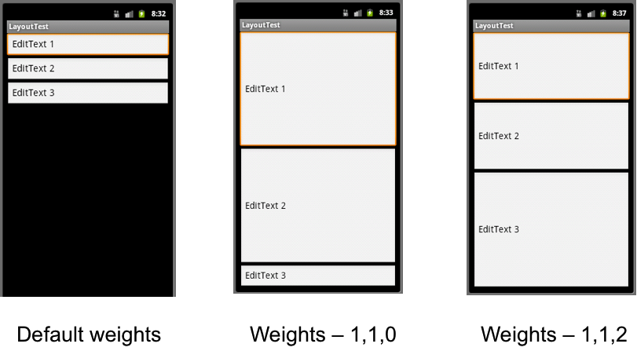
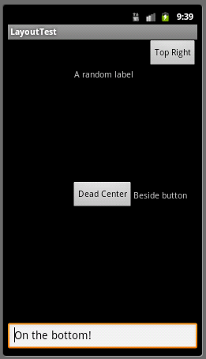
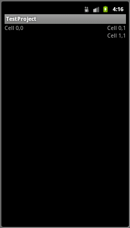

View Heirarchy
==============

[Views](http://developer.android.com/reference/android/view/View.html) in a mobile application are typically associated with an *activity* and are used to render the UI associated with the activity. The view then contains components, known as *widgets*, for each UI element in the view. These widgets are then organized in the view using a *layout* that describes how the widgets are positioned. Finally, the appearance of the layout and widgets can be controlled/adjusted using *attributes* corresponding to the particular type of object.

Views can be created in several ways:

-   XML file - allows for the layout and widgets for a *static* view to be specified at build time.
-   Dynamic - allows for layouts and widgets to be added to a view at run time.
-   Combo - allows for a layout and some widgets to be specified statically and then additional ones added at run time.

Furthermore, multiple views can be combined together into a [ViewGroup](http://developer.android.com/reference/android/view/ViewGroup.html) object.

Once a view has been created (either statically or dynamically) an activity can select the current view to display using the method [setContentView()](http://developer.android.com/reference/android/app/Activity.html#setContentView(int\))).

Widgets
=======

The basic UI components used in a view are known as *widgets* (which are actually subclasses of View). Each widget will have numerous *attributes* which are used to control the appearance of the widget in the view. Once a widget is created, often they will have *event handlers* registered to them such that the application will perform various actions depending on how the user interacted with the widget. Usually each widget will be given a unique **id** attribute so that they can be accessed by the application. Additionally, widgets will usually specify their **layout\_height** and **layout\_width** attributes to describe how they will scale relative to the content they contain. Two typical values for these attributes are

> -   **wrap\_content** - the widget will dynamically size itself to fit the content within the widget
> -   **fill\_parent** - the widget will expand to the full extent of the parent view

Some common widgets are **Button**, **TextView**, **EditText**, **CheckBox**, **RadioButton**, and **Spinner**.

Button
------

One of the most common UI widgets is [Button](http://developer.android.com/reference/android/widget/Button.html) which represents a push-button type object. Usually they simply have some associated text which appears inside the button boundaries and have a click callback registered to them. Typically buttons will use **wrap\_content** attributes so they are rendered the size of the enclosed text. Hence the XML for a button might be:

    <Button
        android:id="@+id/dumbButton"
        android:layout_height="wrap_content"
        android:layout_width="wrap_content"
        android:text="@string/button_text"
    />

Then within the activity code, the click callback would be registered by calling the **setOnClickListener()** method on the Button object passing as a parameter a new **View.OnClickListener** object which has an overridden **onClick()** method. Thus an example would be

    final Button button = (Button) findViewById(R.id.dumbButton);
    button.setOnClickListener(new View.OnClickListener() {
        @Override
        public void onClick(View v) {
            // Whatever TODO when button is clicked
        }
    });

Note that the parameter to the onClick() method is a reference to the widget that was clicked.

Alternatively, the **onClick** XML attribute can be used to specify the name of the callback to be called when the button is clicked.

The background of a button can be set using the [background](http://developer.android.com/reference/android/R.attr.html#background) attribute which can either be a resource or a color value, e.g. android:background="\#FF0000" for a red button.

TextView
--------

[TextView](http://developer.android.com/reference/android/widget/TextView.html) widgets are typically used simply to place a label, i.e. static text, within a view. The text can be modified, however, if the TextView is given an **id** attribute and then the **setText()** method is called on a TextView object created from the resource **id**. Like all other widgets, any event handler can be registerd to a TextView if the application calls for user interaction with the widget. The extent attributes typically are specified as **wrap\_content** for the **layout\_height** and then either **wrap\_content** or **fill\_parent** for the **layout\_width**. An example XML for a TextView might be:

    <TextView
        android:id="@+id/nameLabel"
        android:layout_height="wrap_content"
        android:layout_width="wrap_content"
        android:text="@string/name_label"
    />

EditText
--------

For text boxes that are meant to be editable, i.e. the user can enter text in them, usually an [EditText](http://developer.android.com/reference/android/widget/EditText.html) widget is used. The text attribute (either in the XML or via the **setText()** method) can be used to prepopulate the text box with a default value if desired. Usually event handlers are not registered to EditText widgets, but rather the contents are retrieved from within the event handler of other widgets, e.g. when a button is pressed, using the **getText()** method on an EditText object. Thus typically the extents are set to **wrap\_content** for the **layout\_height** and **fill\_parent** for the **layout\_width** (so the EditText box fills the width of the screen). Example XML for an EditText widget might be

    <EditText
        android:id="@+id/name"
        android:layout_height="wrap_content"
        android:layout_width="fill_parent"
        android:text="@string/name_edit"
    />

CheckBox
--------

If there are certain choices that the user can select, often a [CheckBox](http://developer.android.com/reference/android/widget/CheckBox.html) widget is used. This widget displays a small box that can toggle to checked or unchecked states. The **checked** attribute specifies the initial state of the CheckBox and the **text** attribute gives the text for the CheckBox. Typically the extents for CheckBoxes are **wrap\_content** in both dimensions. Event handlers can be registered for the widget if some behavior should be performed whenever the state changes, otherwise the **isChecked()** method can be called on a CheckBox object within another method to determine the current state of the CheckBox. While the CheckBox widget will keep track of its current state, the state of the CheckBox can also be changed programmatically using the **setChecked()** method if desired (for example when restoring a view). For example, XML for a CheckBox that will call the **onCapsClicked()** method when the state changes might be:

    <CheckBox
        android:id="@+id/capCheck"
        android:layout_width="wrap_content"
        android:layout_height="wrap_content"
        android:text="@string/cap_check_text"
        android:onClick="onCapsClicked"
    />

Then in the activity code, the *onCapsClicked()* method might be defined as

    public void onCapsClicked(View v) {
        // Check if box is set or not
        if (((CheckBox) v).isChecked()) {
            // Do something when checked
        } else {
            // Do something else when unchecked
        }
    }

Note that the View parameter will be a reference to the CheckBox that was selected and thus is cast within the method.

RadioButton
-----------

Radio buttons are typically used for *mutually exclusive* choices the user can make. Thus they are grouped inside a [RadioGroup](http://developer.android.com/reference/android/widget/RadioGroup.html) object which defines which buttons can only have a single one selected. Thus when one [RadioButton](http://developer.android.com/reference/android/widget/RadioButton.html) is selected inside the group, all others are unselected. Usually all RadioButtons within a group will be assigned the same click handler (via the **onClick** attribute). Again usually **wrap\_content** attributes are specified and the **text** attribute is used for the label of each button. For example, XML for a RadioButton group might be:

    <RadioGroup
        android:layout_width="fill_parent"
        android:layout_height="wrap_content"
        android:orientation="vertical">
        <RadioButton
            android:id="@+id/firstNameCheck"
            android:layout_width="wrap_content"
            android:layout_height="wrap_content"
            android:text="@string/first_name_radio"
            android:onClick="onNameGroupClicked"
        />
        <RadioButton
            android:id="@+id/lastNameCheck"
            android:layout_width="wrap_content"
            android:layout_height="wrap_content"
            android:text="@string/last_name_radio"
            android:onClick="onNameGroupClicked"
        />
    </RadioGroup>

RadioButton groups initially have none of the buttons selected (but will subsequently always only have one selected unless the **clearCheck()** method is called on the RadioGroup to clear all selections). An initial selection can be set with the **setChecked()** method called for the desired option. The callback method in the Activity might then be:

    public void onNameGroupClicked(View v) {
        // Get radio button selected
        RadioButton rb = (RadioButton) v;
        // Perform appropriate action for selected option
    }

An alternative to RadioButtons when there are only two selectable options is to use a [ToggleButton](http://developer.android.com/reference/android/widget/ToggleButton.html) where the text for the two states can be set in the **textOn** and **textOff** attributes.

Spinner
-------

One other common widget for selectable lists of options is a [Spinner](http://developer.android.com/reference/android/widget/Spinner.html) which displays the list in a "slot machine" type control that allows the user to then choose one of the items in the list. The Spinner is populated with data from an [Adapter](http://developer.android.com/reference/android/widget/Adapter.html) (or one of its subclasses). Additionally, the prompt displayed inside the spinner can be specified in the **prompt** attribute for the widget. Thus example XML code for a Spinner might be:

    <Spinner
        android:id="@+id/titleSpinner"
        android:layout_width="fill_parent"
        android:layout_height="wrap_content"
        android:prompt="@string/spin_title"
    />

To populate the items in the Spinner, one option is to use a string array (via the \<string-array\>\</string-array\> tags) stored in the **strings.xml** resource file by creating XML with each item in \<item\>\</item\> tags. For example,

    <string-array name="titles">
        <item>Mr.</item>
        <item>Mrs.</item>
        <item>Miss</item>
    </string-array>

Then we can create an [ArrayAdapter](http://developer.android.com/reference/android/widget/Adapter.html) object from the string array stored in the resource and initialize the Spinner with the ArrayAdapter as:

    Spinner titleSpinner = (Spinner) findViewById(R.id.titleSpinner);
    ArrayAdapter<CharSequence> titleAdapter = ArrayAdapter.createFromResource(
        this, R.array.titles, android.R.layout.simple_spinner_item);
    titleAdapter.setDropDownViewResource(android.R.layout.simple_spinner_dropdown_item);
    titleSpinner.setAdapter(titleAdapter);
    titleSpinner.setOnItemSelectedListener(new TitleSelectedListener());

The two parameters **android.R.layout.simple\_spinner\_item** and **android.R.layout.simple\_spinner\_item** are Android build in layouts for standard spinner appearance and behavior. The behavior to perform when an item is selected from the Spinner is set using **setOnItemSelectedListener()** explained below.

Once the spinner is created, we associate a callback to the Adapter to set appropriate behavior when an item is selected from the Spinner. This is accomplished by creating a class that implements **OnItemSelectedListener** with two required methods - **onItemSelected()** and **onNothingSelected()**. Thus an example of a callback for the previous adapter might be:

    public class TitleSelectedListener implements OnItemSelectedListener {
        // Item selected
        public void onItemSelected(AdapterView<?> parent, View v, int pos, long id) {
            // Do something with selected object using
            // parent.getItemAtPosition(pos) to retrieve selected object
        }

        // Nothing selected
        public void onNothingSelected(AdapterView parent) {
            // Do whatever necessary if no item selected
        }
    }

Layouts
=======

Once we have decided which of the common widgets we wish to use in our Android application, we then need to decide on the positioning of the widgets inside a view. This positioning is accomplished by a *layout*. When a layout is created, a variety of attributes are used to determine how the widgets will be rendered using the layout. The most common layout styles are **LinearLayout**, **RelativeLayout**, and **TableLayout**.

LinearLayout
------------

[LinearLayout](http://developer.android.com/reference/android/widget/LinearLayout.html) is the most basic layout that simply aligns all widgets in a particular direction (either vertically or horizontally) based on the **orientation** attribute. Thus for a vertical layout all child widgets are stacked on top of each other (one per row regardless of their width) and a horizontal layout will place the widgets side by side in a single row (with height equal to the tallest widget).

**Gravity**

Child widgets inside a linear layout can specify a **gravity** attribute which determines their alignment property - **left**, **right**, or **center**.

**Weight**

Each child can also be assigned an (integer) **layout\_weight** attribute which describes the proportional size of the children in the layout. The default weight value for widgets is 0, meaning to render each widget at its normal size. However if we wish to have them occupy proportionally different areas we can specify weights for each. For example if we have three EditText widgets (which normally occupy one line each) and specify weights of 1, 1, and 0 then the third one will still only be one line high while the other two will equally split the remaining screen height. Alternatively, if the first two EditText boxes have weights 1, 1 and the third has weight 2 then the last one will be twice as high as the other two (which will split the remaining height). Thus the first two will be one quarter of the screen height while the third will occupy the lower half of the screen. These examples are shown below

> 

*Hint:* To have widgets proportionally scale to fit all available space, simply set their width/height to **0dip** in the desired dimension and weight them accordingly.

**Nesting**

LinearLayout groups (actually any layout type) can be *nested* inside other LinearLayout groups. All widget attributes, e.g. fill sizes, weights, etc., are relative to the enclosing layout. Thus more complicated layouts can be created by appropriate nesting of different layouts. Typically nested LinearLayouts have **wrap\_content** sizing in order to allow room for additional widgets below/beside them.

RelativeLayout
--------------

[RelativeLayout](http://developer.android.com/reference/android/widget/RelativeLayout.html) allows for more flexible placement of widgets relative to each other and their parent window without necessitating a top-down or left-right organization (thus sometimes simplifying a nested LinearLayout view). However care must be taken such that there are no circular dependencies between widgets in the layout. To utilize a RelativeLayout, each widget usually needs to have an **id** attribute in order to determine which other widgets their positioning is relative to (unless they are strictly positioned relative to the parent window). Clearly in the XML layout file, elements must be specified in the order in which they are referred to, i.e. a widget must exist before another can be positioned relative to it.

All of the alignment options are specified in [RelativeLayout.LayoutParams](http://developer.android.com/reference/android/widget/RelativeLayout.LayoutParams.html) with some common ones being:

> -   **layout\_alignParent[Top, Bottom, Left, Right]** - positions the widget at one of the edges of the parent window.
> -   **layout\_above** - positions the widget above another widget (using **id**)
> -   **layout\_below** - positions the widget below another widget (using **id**)
> -   **layout\_toLeftOf** - positions the widget to the left of another widget (using **id**)
> -   **layout\_toRightOf** - positions the widget to the right of another widget (using **id**)
> -   **layout\_align[Top, Bottom, Left, Right]** - positions the widget so that the edge is aligned with the corresponding edge of another widget (using **id**)
> -   **layout\_center[Vertical, Horizontal]** - positions the widget in the center (vertically or horizontally) in the parent
> -   **layout\_centerInParent** - centers the widget in the parent window

Hence an example of a RelativeLayout might be:

    <RelativeLayout xmlns:android="http://schemas.android.com/apk/res/android"
        android:layout_width="fill_parent"
        android:layout_height="fill_parent">
        <Button
            android:id="@+id/middleButton"
            android:layout_width="wrap_content"
            android:layout_height="wrap_content"
            android:layout_centerInParent="true"
            android:text="Dead Center"
        />

        <EditText
            android:id="@+id/atBottomText"
            android:layout_width="fill_parent"
            android:layout_height="wrap_content"
            android:layout_alignParentBottom="true"
            android:text="On the bottom!"
        />

        <TextView
            android:id="@+id/buttonText"
            android:layout_width="wrap_content"
            android:layout_height="wrap_content"
            android:layout_centerVertical="true"
            android:layout_toRightOf="@id/middleButton"
            android:text="Beside button"
        />

        <Button
            android:id="@+id/topRightButton"
            android:layout_width="wrap_content"
            android:layout_height="wrap_content"
            android:layout_alignParentTop="true"
            android:layout_alignParentRight="true"
            android:text="Top Right"
        />

        <TextView
            android:id="@+id/randomLabel"
            android:layout_width="wrap_content"
            android:layout_height="wrap_content"
            android:layout_below="@id/topRightButton"
            android:layout_alignRight="@id/middleButton"
            android:text="A random label"
        />
    </RelativeLayout>

Which renders as

> 

TableLayout
-----------

[TableLayout](http://developer.android.com/reference/android/widget/TableLayout.html) is a way to organize widgets into rows/columns (without borders for the cells) similar to HTML tables. All rows will have the same number of columns (determined by the row with the most columns). Cells may be empty but cannot span columns. The table layout is comprised of [TableRow](http://developer.android.com/reference/android/widget/TableRow.html) child views which behaves similarly to a LinearLayout with **horizontal** orientation. Nested inside the TableRow structure are the widgets for that row (note the widgets do not specify a **layout\_width** attribute). The width of a column will be set to the width of the widest cell in the column. However, columns can be specified as shrinkable and/or stretchable such that the table can shrink to fit inside the parent or stretched to fill any extra space. Finally the column for a widget can be explicitly specified using the **layout\_column** attribute, but columns must be specified in increasing order in a given row (with gaps interpreted as empty cells).

Hence an example of a TableLayout might be:

    <TableLayout
        android:id="@+id/exampleTable"
        android:layout_width="fill_parent"
        android:layout_height="wrap_content"
        android:stretchColumns="0">

        <TableRow>
            <TextView
                android:text="Cell 0,0"
            />
            <TextView
                android:text="Cell 0,1"
            />
        </TableRow>

        <TableRow>
            <TextView
                android:layout_column="1"
                android:text="Cell 1,1"
            />
        </TableRow>
    </TableLayout>

which would render as

> 
