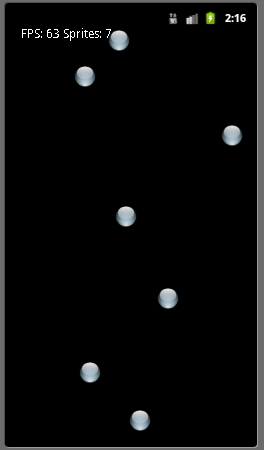

The Android platform provides several mechanisms for rendering 2D graphics including:

> -   The [Canvas](http://developer.android.com/reference/android/graphics/Canvas.html) and [Drawable](http://developer.android.com/reference/android/graphics/drawable/Drawable.html) classes. While graphics can also be directly drawn on a **View** object, this is often only appropriate for simple static graphics. Alternatively, using a **Canvas** object allows for the drawing to be done in a separate thread and thus allows the UI to remain responsive (particularly for interactive games).
> -   [OpenGL-ES](http://developer.android.com/guide/topics/graphics/opengl.html) (versions 1.0, 2.0 for Android 2.2+, and 3.0 for Android 4.3+) can be used for more advanced 2D, as well as 3D, graphics. However the devices must have adequate graphics hardware for this approach. For very high performance applications, the [Android NDK](http://developer.android.com/sdk/ndk/index.html) can be used with OpenGL.

In this lecture we will discuss the **Canvas**/**Drawable** model for 2D and then next time present a framework for implementing simple 3D graphics using OpenGL.

Drawing directly in the View
============================

The simplest way to incorporate 2D graphics into an application is to utilize the **Canvas** object through the **View**'s **onDraw()** method. The **Canvas** object provides several methods for drawing simple shapes via **draw\*()** methods (e.g. **drawLine()**, **drawCircle()**, etc.). The application **Activity** can then simply use the **View** to render the graphics. Thus a simple application to draw a circle might be:

    BasicDraw.java

        public class BasicDraw extends Activity {

           /** Called when the activity is first created. */
           @Override
           public void onCreate(Bundle savedInstanceState) {
              super.onCreate(savedInstanceState);
              final DrawView drawView = new DrawView(this);
              setContentView(drawView);
           }
        }

    DrawView.java

        public class DrawView extends View {
           Paint paint;
           Context c;
           float x;
           float y;

           public DrawView(Context context) {
              super(context);
              c = context;
              paint = new Paint();
              paint.setColor(Color.WHITE);
              paint.setAntiAlias(true);
              x = 100.0f;
              y = 100.0f;
           }

           @Override
           public void onDraw(Canvas canvas) {
              canvas.drawCircle(x, y, 20, paint);
           }
        }

Sprites can also be handled (assuming they are stored in a resource file, e.g. **sprite.png** file in the **res/drawable** directory) by adding a field of type [Bitmap](http://developer.android.com/reference/android/graphics/Bitmap.html) and initializing it in the constructor via a method in the [BitmapFactory](http://developer.android.com/reference/android/graphics/BitmapFactory.html) class as:

    mBitmap = BitmapFactory.decodeResource(getResources(), R.drawable.sprite);

Then the bitmap can be rendered via the **drawBitmap()** method of the canvas object in the **onDraw()** method. For example, the image stored in **mBitmap** can be drawn on the **canvas** using the **paint** object assuming **mX** and **mY** are fields storing the desired top-left *x* and *y* coordinates for the sprite

    canvas.drawBitmap(mBitmap, mX, mY, paint);

OnTouch handler
---------------

Unlike widgets, e.g. buttons, which typically respond to click events (via **onClickListener()** methods), graphics use an alternative callback for **touch** events which allow for the handling of gestures (including swipes and multi-touch gestures like pinch and zoom). Touch handlers are registered in a similar manner via an **onTouchListener()** method which then must override the **onTouch()** method. The **onTouch** method has two parameters - the **View** which was touched and a [MotionEvent](http://developer.android.com/reference/android/view/MotionEvent.html) object which contains information about where and/or how the view was touched including the number of events that occured (e.g. multitouch gestures) as well as the type of motion that occured. Once any states have been updated (using the information in the touch event), the **View** can be redrawn by calling the **invalidate()** method (**NOT** the **onDraw()** method directly). Hence a touch callback could be registered for the above activity within the constructor to draw the circle wherever the user touches as:

    drawView.requestFocus();
    drawView.setOnTouchListener(new View.OnTouchListener() {

       @Override
       public boolean onTouch(View v, MotionEvent event) {
          drawView.x = event.getX();
          drawView.y = event.getY();
          drawView.invalidate();
          return true;
       }
    });

Basic animation can be accomplished by simply calling the **invalidate()** method from within the **onDraw()** method (although probably a call to **Thread.sleep()** should be made to prevent the UI from becoming unresponsive). However if animation is desired, a better approach is to create a **SurfaceView** object in a separate thread to perform the rendering of the graphics.

Drawing in a separate thread
============================

Whenever dynamically changing graphics and/or performance intensive user interaction, e.g. games, are needed, it is better to perform the drawing in a separate thread using a [SurfaceView](http://developer.android.com/reference/android/view/SurfaceView.html) object. This allows the graphics to render as quickly as possible while still allowing the user interface to be responsive.

Sprite class
------------

First we will create a simple **Sprite** class for the bitmap objects we will be rendering containing fields for its position, velocity, and bitmap stored as a resource named **ball_sprite.png** as:

    public class Sprite {
       private float mX;
       private float mY;
       private int mDx;
       private int mDy;
       private Bitmap mBitmap;

       // Constructor
       public Sprite(Resources res, int x, int y) {
          // Get bitmap from resource file
          mBitmap = BitmapFactory.decodeResource(res, R.drawable.ball_sprite);

          // Store upper left corner coordinates
          mX = x - mBitmap.getWidth()/2;
          mY = y - mBitmap.getHeight()/2;

          // Set random velocity
          Random rand = new Random();
          mDx = rand.nextInt(7) - 3;
          mDy = rand.nextInt(7) - 3;
       }

       // Render bitmap at current location 
       public void doDraw(Canvas canvas) {
          canvas.drawBitmap(mBitmap, mX, mY, null);
       }

       // Update (time-based) position
       public void update(long elapsedTime) {
          mX += mDx * (elapsedTime / 20f);
          mY += mDy * (elapsedTime / 20f);
          checkBoundary();
       }

       // Collision detection
       private void checkBoundary() {
          // Left or right boundary
          if (mX <= 0) {
             mDx *= -1;
             mX = 0;
          } else if (mX + mBitmap.getWidth() >= Panel.mWidth) {
             mDx *= -1;
             mX = Panel.mWidth - mBitmap.getWidth();
          }

          // Top or bottom boundary
          if (mY <= 0) {
             mDy *= -1;
             mY = 0;
          } else if (mY + mBitmap.getHeight() >= Panel.mHeight) {
             mDy *= -1;
             mY = Panel.mHeight - mBitmap.getHeight();
          }
       }
    }

Note the class contains a draw method which renders the bitmap at the current position, an update method to modify the position (time) based on the velocity, and a collision detection method to keep it within the extents of the window (flipping the directions when an edge is reached).

Subclass **SurfaceView**
------------------------

The next step is to create our **View** class by subclassing **SurfaceView** and implementing the [SurfaceHolder.Callback](http://developer.android.com/reference/android/view/SurfaceHolder.Callback.html) interface (registering itself as the callback) which will contain a list of **Sprite** objects, a field for the total number of sprites (for efficiency), a paint object field, and fields for its current extents.

    public class Panel extends SurfaceView implements SurfaceHolder.Callback {
       private ArrayList<Sprite> mSpriteList = new ArrayList<Sprite>();
       private int mNumSprites;
       private Paint mPaint;
       public static float mWidth;
       public static float mHeight;

       public Panel(Context context) {
          super(context);
          getHolder().addCallback(this);
          mPaint = new Paint();
          mPaint.setColor(Color.WHITE);
       }

The **SurfaceHolder.Callback** interface requires us to override three methods to handle when the surface is created, changed (which simply stores the new extents), or destroyed. These methods have the following forms

    @Override
    public void surfaceCreated(SurfaceHolder holder) {
       // TODO Auto-generated method stub
    }

    @Override
    public void surfaceChanged(SurfaceHolder holder, int format, int width, int height) {
       // Store new extents
       mWidth = width;
       mHeight = height;
    }

    @Override
    public void surfaceDestroyed(SurfaceHolder holder) {
       // TODO Auto-generated method stub
    }

We will define these methods once we have created a class for our rendering thread.

Rendering thread
----------------

In order to maintain usability of the application, we will render our graphics in a separate thread. Hence we will subclass the **Thread** class and call the necessary update and render methods in the **run()** method. In order to access the **Canvas** object for drawing, we will need to obtain a lock on the **Canvas** object from the **SurfaceHolder** that contains our drawing surface (being sure to release the lock once drawing is completed). Furthermore, we can produce *time-based* animations by retrieving the current system time and computing an elapsed time between render passes. Thus our thread class might be:

    public class ViewThread extends Thread {
       private Panel mPanel;
       private SurfaceHolder mHolder;
       private boolean mRun = false;
       private long mStartTime;
       private long mElapsed;

       public ViewThread(Panel panel) {
          mPanel = panel;
          mHolder = mPanel.getHolder();
       }

       // Set current thread state
       public void setRunning(boolean run) {
          mRun = run;
       }

       @Override
       public void run() {
          Canvas canvas = null;

          // Retrieve time when thread starts
          mStartTime = System.currentTimeMillis();

          // Thread loop
          while (mRun) {
             // Obtain lock on canvas object
             canvas = mHolder.lockCanvas();

             if (canvas != null) {
                // Update state based on elapsed time 
                mElapsed = System.currentTimeMillis() - mStartTime;
                mPanel.update(mElapsed);

                // Render updated state
                mPanel.doDraw(canvas,mElapsed);

                // Release lock on canvas object
                mHolder.unlockCanvasAndPost(canvas);
             }

             // Update start time
             mStartTime = System.currentTimeMillis();
          }
       }
    }

Use thread class in **SurfaceView**
---------------------------------

We can now add a thread field to our **SurfaceView** object as

    private ViewThread mThread;

and initialize it in the constructor with

    mThread = new ViewThread(this);

We now add code to the **surfaceCreated()** method to start the animation thread as:

    public void surfaceCreated(SurfaceHolder holder) {
       // Create and start new thread
       if (!mThread.isAlive()) {
          mThread = new ViewThread(this);
          mThread.setRunning(true);
          mThread.start();
       }
    }

We also want to be sure to stop the thread whenever the surface is destroyed as:

    public void surfaceDestroyed(SurfaceHolder holder) {
       // Stop thread
       if (mThread.isAlive()) {
          mThread.setRunning(false);
       }
    }

Next we add update and drawing methods which simply iterate through the sprite list and call the update/draw methods for each sprite object. However since this is done in a separate thread, we need to ensure that the list is not concurently being updated (i.e. new sprites are being added while current ones are being rendered). Thus we will place the iteration loop inside a **synchronized()** block giving

    // Update all sprites in list
    public void update(long elapsedTime) {
       synchronized (mSpriteList) {
          for (Sprite sprite : mSpriteList) {
             sprite.update(elapsedTime);
          }
       }
    }

    // Draw all sprites in list
    public void doDraw(Canvas canvas, long elapsed) {
       canvas.drawColor(Color.BLACK);
       synchronized (mSpriteList) {
          for (Sprite sprite : mSpriteList) {
             sprite.doDraw(canvas);
          }
       }
    }

Finally, we can register a touch callback for the **SurfaceView** by adding an **onTouchEvent()** method which will get the location of the touch (from the **MotionEvent** parameter) and (thread safely) add a new sprite to the list (using the same bitmap resource) as

    @Override
    public boolean onTouchEvent(MotionEvent event) {
       synchronized (mSpriteList) {
          mSpriteList.add(new Sprite(getResources(), (int) event.getX(), (int) event.getY()));
          mNumSprites = mSpriteList.size();
       }
       return super.onTouchEvent(event);
    }

Note that we avoid continually retrieving the number of sprites in the list (which would be done for each rendering pass) by simply updating a local field whenever a new sprite is added.

Drawing text
------------

Text can easily be displayed in a **Canvas** object using the **drawText()** method. Hence at the end of the **doDraw()** method for our **SurfaceView** object above we could add

    canvas.drawText("FPS: " + Math.round(1000f / elapsed) + " Sprites: " + mNumSprites, 10, 10, mPaint);

to display the current FPS being achieved as well as the number of sprites currently on the screen at the top of the window (i.e. at position 10,10).

Thus the application would appear as

> 
