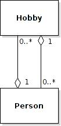

# One-to-many relationships

Let's say we want to enhance our inventory system by representing vendors, so that each item has a vendor.  In UML:

Like the **Item** class, the **Vendor** class has an **id** field.  Each vendor will be assigned a unique id.  The vendor's unique id is then referenced from the **Item** class as the **vendorId** field.

This is a *one-to-many* relationship because each item is associated with exactly one vendor, and each vendor is associated with an arbitrary number of items.

In SQL:

    create table items (
      id integer primary key autoincrement,
      vendor_id integer
      name varchar(80) unique,
      quantity integer
    )
    
    create table vendors (
      id integer primary key autoincrement,
      name varchar(80) unique
    )

Now, let's say we want to get all of the items offered by a particular vendor.  All we need to know is the unique id of the vendor:

    select items.*
      from items, vendors
     where items.vendor_id = vendors.id
       and vendors.id = ?

In this query, we are assuming that the id of the vendor whose items we are searching for will be bound to the placeholder (?).

# Many-to-many relationships

Occasionally you might need to model a many-to-many relationship:

In this example, a Person can have many hobbies, and because more than one person can share the same hobby, a hobby is associated with an arbitrary number of persons.

At the database level, we can model such relationships using a *link table*:

    create table persons {
      id integer primary key autoincrement,
      firstname varchar(80),
      lastname varchar(80),
      ...
    )

    create table hobbies {
      id integer primary key autoincrement,
      name varchar(80),
      ...
    )
    
    create table person_hobbies {
      person_id integer,
      hobby_id integer
    )

Each row in the **person\_hobbies** table links a particular person with a particular hobby.

Note that it would be a good idea to create a unique index on the combination of **person\_id** and **hobby\_id** in the **person\_hobbies** table, to ensure that there is at most one link between one person and one hobby.

<!-- vim:set wrap: ­-->
<!-- vim:set linebreak: -->
<!-- vim:set nolist: -->
